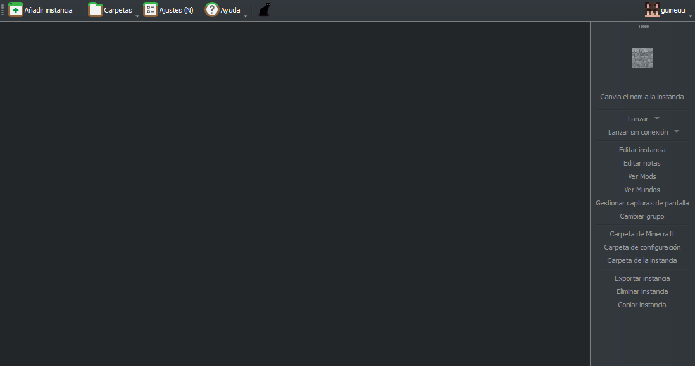
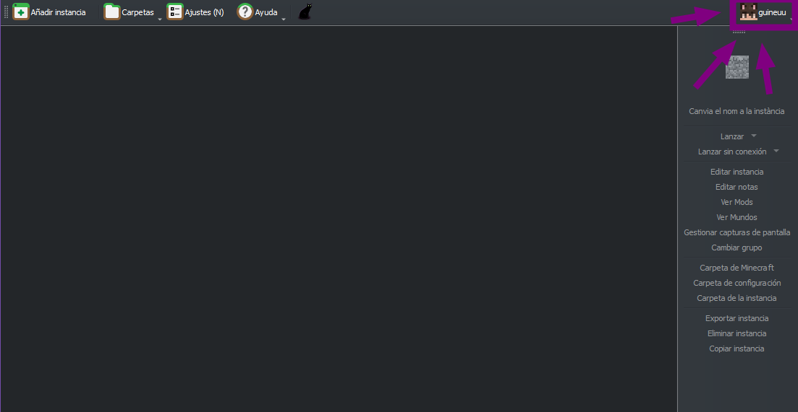
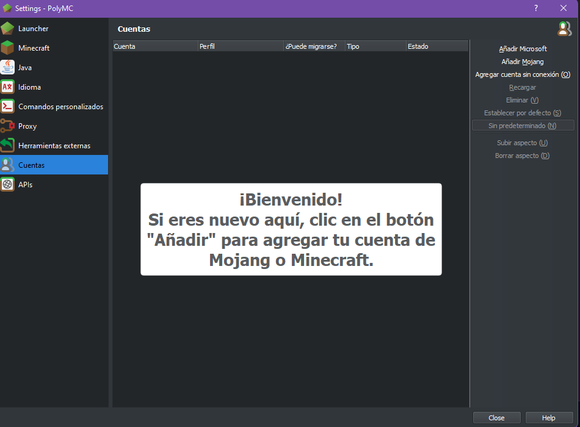
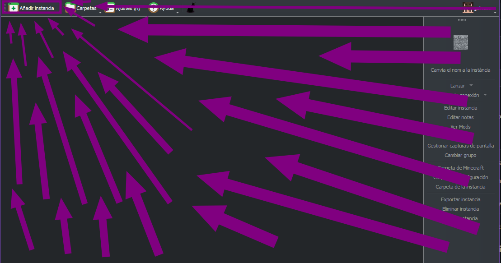
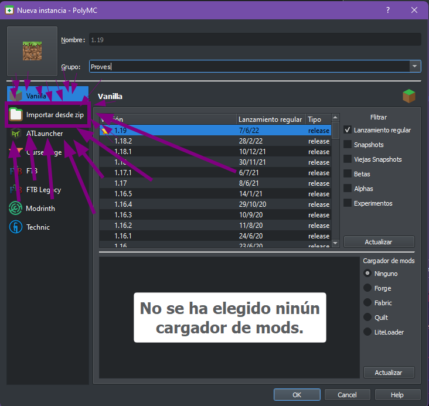
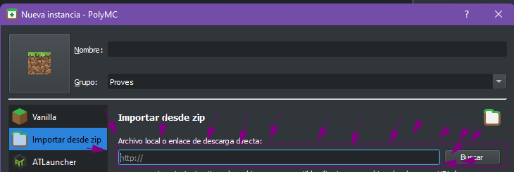

# GosolCraft 1.19.x (Veranito Edition)

> 'We, eh, dentro del mundo de Minecraft si que puedo valerme' - Zarcort Game
---

## Índice

- <a href="#-instalación-del-launcher-">🧊 Instalación del launcher 🧊</a>
- <a href="#-instalación-del-pack-%EF%B8%8F">🗻 Instalación del pack ❄️</a>
  - [Información](#información)
  - [Guia de instalación](#guia-de-instalación)
- <a href="#-conexión-al-servidor-y-otros-links">🚪 Conexión al servidor y otros links🚪</a>

## 🧊 Instalación del launcher 🧊

Primero debemos descargar PolyMC. Para descargarlo debemos ir a las siguientes paginas:

- **Windows (gente normal):** [Desarga de PolyMC](https://github.com/PolyMC/PolyMC/releases/download/1.3.2/PolyMC-Windows-x86_64-Setup-1.3.2.exe)
- **Linux (basado):** Utiliza tu gestor de paquetes. [AUR](https://aur.archlinux.org/packages/polymc) **//** [Flatpack - Universal](https://flathub.org/apps/details/org.polymc.PolyMC)
- **Conde:** [Descargas de ManyMC](https://github.com/MinecraftMachina/ManyMC/releases/download/v0.1.2/ManyMC.zip)

*Los siguentes pasos son iguales uses ManyMC o PolyMC.*

Por favor, selecciona como de masticada quieres la guia:

  
<strong>😎 Gigachad/Gigastacy se lo que me hago</strong>

  
  <strong>[ ! ] Importante tener instalado Java. Muy recomendado de 64 bits.</strong>  

  1. Abre el launcher y inicia sesión clicando en "Perfiles" (Parte superiror derecha). Asegurate de elegir el tipo de cuenta correcto (Mojang o Microsoft).  
  2. Ya puedes pasar al siguiente paso!
  

  
<strong>👶 Gugugaga me hice caca👶</strong>

  
  <strong>[ ! ] Importante tener instalado Java. Muy recomendado de 64 bits.</strong>  

  1. Inicia el launcher. Verás un programa similar a este:  
  
  2. A continuación iniciaremos sesión. Para ello clicaremos en el botón de arriba a la derecha y entraremos en el administrador de cuentas: 
  
  3. Toca iniciar sesión. Si aún tienes una cuenta de Mojang te recomiendo encarecidamente que la migres ahora, igualmente aún tienes la opción de usarla.  
  <strong>(Puedes migar tu cuenta [aquí](https://www.minecraft.net/es-es/login).)</strong>
  
  4. Ya puedes pasar al siguiente paso!

## 🗻 Instalación del pack ❄️

## Información

Para esta edición he preparado un sismema que se encargará de actualizar y descargar mods desde una configuación creada por mi en la nube. Vosotros solo teneis que importar un ZIP y el programa se encarga del resto.

Existen dos packs distintos. Uno llamado GosolCraft(⛰️) y el otro Gosolcraft Neu (❄️).

**GosolCraft (Base)** está enfocado a proporcionar **más rendimeinto**.

**GosolCraft Neu** está enfocado a proporcionar **herramientas para jugadores más tecnicos**. Tambien requiere más recuros.

**Podeis ver las diferencias en la siguiente tabla:**

| Mods                                | Que hacen                    | ⛰️ | ❄️ |
|-------------------------------------|------------------------------|----|----|
| *Sodimum, Lithium, Starlight, C2ME* | Optimización                 | 🟩 | 🟩 |
| *FancyMenu, Drippy Loading Screen*  | Menús personalizados         | 🟩 | 🟩 |
| *Iris*                              | Shaders                      | 🟩 | 🟩 |
| *ComplementaryShaders*  (Iris)      | Pack de shaders incluido[^1] | 🟥 | 🟩 |
| *Simple Voice Chat*                 | Chat de voz integrado        | 🟩 | 🟩 |
| *Sound Physics Remasetered*         | Fisicas de sonido            | 🟩 | 🟩 |
| *Indium, Continuum*                 | Texturas conectadas          | 🟥 | 🟩 |
| *Borderless Mining*                 | Ventana sin bordes           | 🟥 | 🟩 |
| *Inspectio*                         | Info técnica de items        | 🟥 | 🟩 |
| *Zoomify*                           | Zooom                        | 🟥 | 🟩 |
| *MouseWheelie*                      | Gestión de inventario        | 🟥 | 🟩 |

[^1]: Simplemente van incluidos. Puedes instalarlos igual en GosolCraft (Base).

## Guia de instalación

Para instalar el pack que hayais elegido segud los siguientes pasos:

1. Haz click en "Añadir instancia"

2. Haz click en "Importar desde ZIP"

3. En el siguiente campo pega la URL que corresponda al pack que quieres instalar:

En caso de querer *GosolCraft (Base)* pega esta URL: `https://gosol.tardor.cat/Gosol.zip`.\
En caso de querer *GosolCraft Neu* pega esta URL: `https://gosol.tardor.cat/Neu.zip`.

Ya está. Si todo sale bien al iniciar el juego los mods se descargan automaticamente!

## 🚪 Conexión al servidor y otros links🚪

No la necesitaréis en principio pero la IP es: `mc.tardor.cat:25665`.

### Repositorios y información tecnica

- Más información sobre *packwiz*, la herramienta detrás del modpack y el instalador [aquí](https://github.com/packwiz/packwiz).
- El repositorio donde se encuentra el pack está [aquí](https://github.com/guineuu/gosol).
- El antiguo respositorio (no mantenido) está [aquí](https://codeberg.org/guineu/gosol-old).

> Si necesitas ayuda puedes hablarme en discord: ***guineu#5411***

---
*with💜 by [guineu](http://tardor.cat)*
